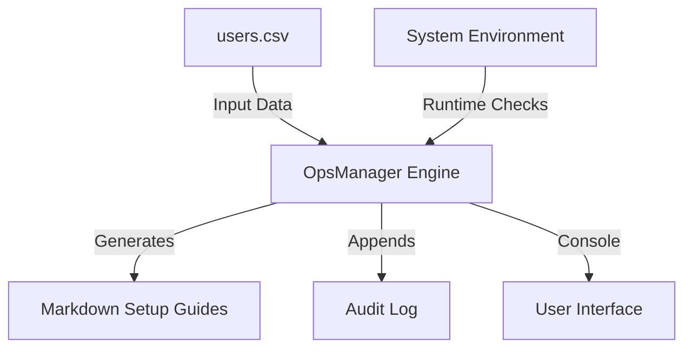
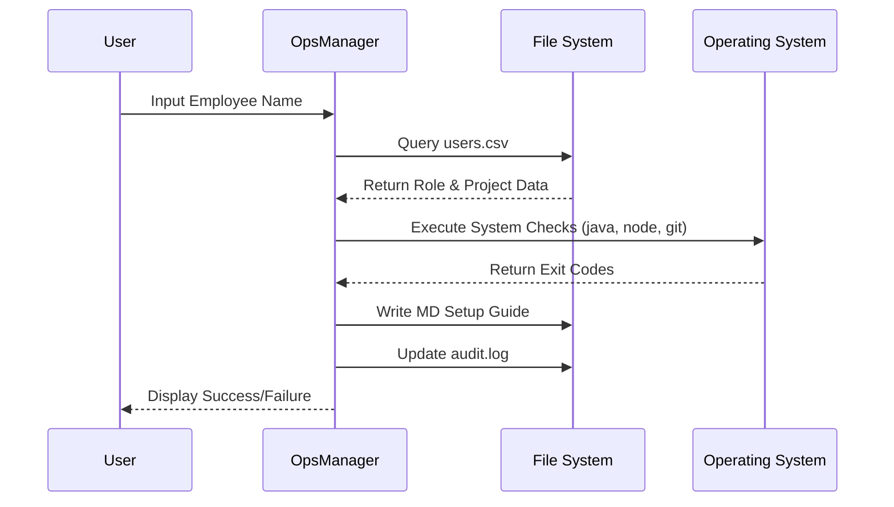

# OpsCompanion: System Administration & Onboarding Automator

## Project Overview
OpsCompanion is a Java-based utility designed to streamline the technical onboarding process for engineering teams. The tool automates workstation diagnostics, verifies environment configurations, and generates project-specific documentation to ensure compliance with technical standards.

## System Architecture
The following diagram illustrates the data flow and system interaction:



### Technical Features

- **Automated Workstation Diagnostics:** Executes system calls to verify the operational status of Java JDK, Node.js, and Git version control.
- **Environment Configuration Control:** Validates critical environment variables such as `JAVA_HOME` to prevent configuration-related downtime.
- **Dynamic Documentation Generation:** Produces individualized onboarding guides based on user roles and assigned projects.
- **Security & Auditability:** Maintains an encrypted-entry audit log for tracking administrative actions and system access attempts.

### Process Flow
The application follows a structured sequence to ensure data integrity:



## Requirements and Execution

### Prerequisites

- Java Development Kit (JDK) 8 or higher
- System `PATH` access for target tools (Git, Node.js)

### Compilation

From the project root, execute the following command:

```bash
javac src/*.java
```

### Execution

Run the application using the classpath flag:

```bash
java -cp . src.OpsManager
```

## DevOps & Systems Engineering Context

This tool addresses the operational requirements of maintaining large-scale engineering platforms. By automating the verification of the local development environment, it reduces the mean time to onboard (MTTO) and ensures that all engineers operate on a standardized toolset.