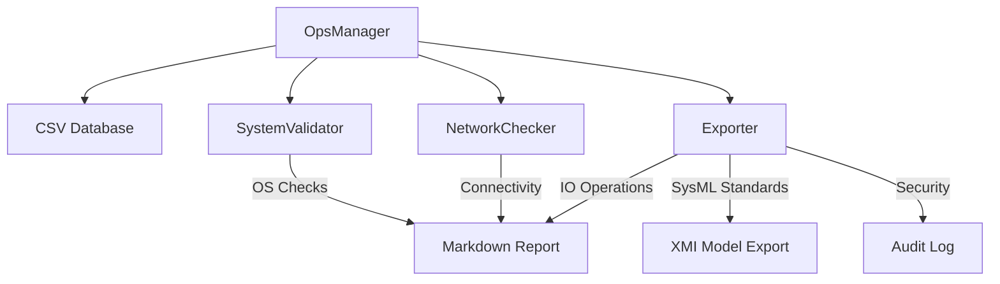
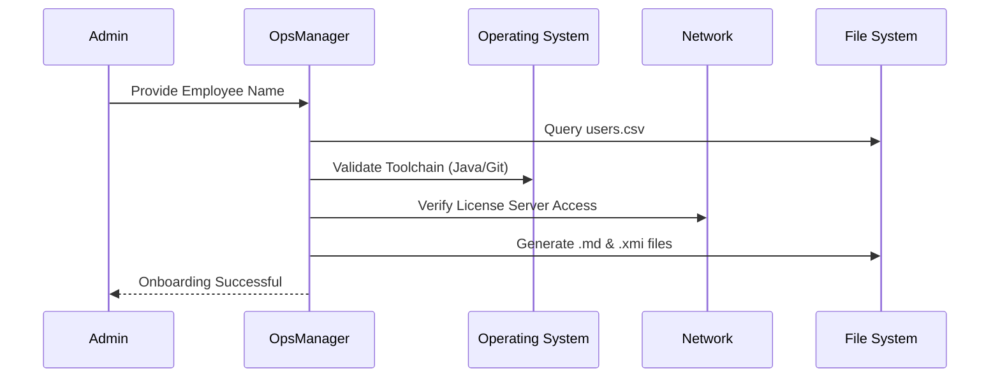

# OpsCompanion: Modular System Administration & MBSE Integration


## Project Overview
OpsCompanion is a professional Java-based utility designed to streamline technical onboarding and system validation. The project has been refactored into a modular architecture to demonstrate high-quality software engineering principles such as **Separation of Concerns (SoC)** and **Single Responsibility**.


## System Architecture
The application is divided into specialized modules, ensuring the system is scalable and easy to maintain.



### Modular Structure

- **OpsManager (Orchestrator):** The main entry point that coordinates the workflow between modules.

- **SystemValidator:** Executes runtime diagnostics of the local environment (JDK, Git, Environment Variables).

- **NetworkChecker:** A connectivity suite that verifies access to critical infrastructure and license servers.

- **Exporter:** Handles multi-format data generation, including human-readable documentation and machine-readable models.

- **UserConfig:** The data model representing engineer profiles and project-specific requirements.


### Technical Features

- **MBSE Interoperability:** Generates XMI (XML Metadata Interchange) files compatible with UML/SysML tools like Eclipse Papyrus.

- **Infrastructure Verification:** Real-time ICMP/Ping diagnostics to ensure developer workstations can reach required servers.

- **Automated Documentation:** Generates personalized Markdown guides based on role-specific data from a CSV backend.

- **Traceability:** Implements a persistent audit log for administrative compliance and security tracking.


### Process Flow
The application follows a structured sequence to ensure data integrity:



## Requirements and Execution

### Prerequisites

- Java Development Kit (JDK) 8 or higher
- System `PATH` access for target tools (Git, Node.js)

### Compilation

From the project root, execute the following command:

```bash
javac src/*.java
```

### Execution

Run the application using the classpath flag:

```bash
java -cp . src.OpsManager
```

## DevOps & Systems Engineering Context

This tool addresses the operational requirements of maintaining large-scale engineering platforms. By automating the verification of the local development environment, it reduces the mean time to onboard (MTTO) and ensures that all engineers operate on a standardized toolset.
